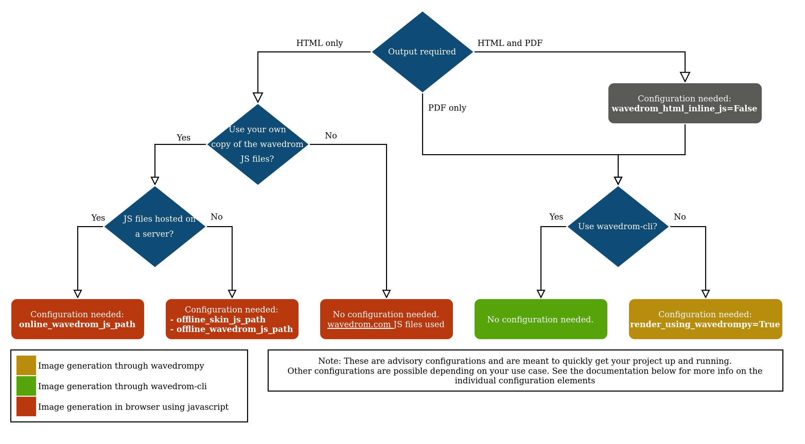

Sphinx wavedrom extension
=========================

A sphinx extension that allows including wavedrom diagrams by using its text-based representation

Wavedrom online editor and tutorial: http://wavedrom.com/

.. image:: https://travis-ci.org/bavovanachte/sphinx-wavedrom.svg?branch=master
	:target: https://travis-ci.org/bavovanachte/sphinx-wavedrom

.. image:: https://badge.fury.io/py/sphinxcontrib-wavedrom.svg
	:target: https://badge.fury.io/py/sphinxcontrib-wavedrom

Installation
------------

The wavedrom extension can be installed using pip:

::

	pip install sphinxcontrib-wavedrom

and by adding **'sphinxcontrib.wavedrom'** to the extensions list in your conf.py file.

Directives
----------

The extension is useable in the form of an extra wavedrom directive, as shown below.

::

	.. wavedrom::

		{ "signal": [
		  	{ "name": "clk",  "wave": "P......" },
		  	{ "name": "bus",  "wave": "x.==.=x", "data": ["head", "body", "tail", "data"] },
		  	{ "name": "wire", "wave": "0.1..0." }
		]}

Alternatively, it can read the json from a file:

::

	.. wavedrom:: mywave.json

When configured to generate images (see `Configuration`_) the directive will generate an image and include
it into the input. It allows for the same configuration as the image directive:

::

	.. wavedrom:: mywave.json
        :height: 100px
        :width: 200 px
        :scale: 50 %
        :alt: alternate text
        :align: right

The image can be turned into a figure by adding a caption:

::

    .. wavedrom:: mywave.json
        :caption: My wave figure

The extension can be configured (see `Configuration`_) to not generate an image out of the diagram description
itself, but to surround it with some html and js tags in the final html document that allow the images to be rendered
by the browser. This is the currently the default for HTML output.

Configuration
-------------

The following decision tree gives an overview of which configurations to make in different use cases:



The extension can be configured to either directly output images or by emitting the javascript to live-render the
wavedrom code, which obviously only works for HTML output. All other outputs (most notably ``latexpdf``) embed a
generated image in any case, but this is only supported when using Python 3.

For HTML output the configuration item ``wavedrom_html_jsinline`` (default: ``True``) can toggled to generate images
instead of inline javascript code. You must add the following line to your ``conf.py``:

::

    wavedrom_html_jsinline = False

or overwrite the setting on the command line, for example:

::

    sphinx-build -b html -D wavedrom_html_jsinline=0 sources build/html

HTML: Inline Javascript
```````````````````````

When HTML building is configured to inline the javascript (default), the extension can work in 2 modes:

- Online mode: 	the extension links to the javascript file(s) provided by the wavedrom server
- Offline mode: the extension uses the javascript file(s) that are saved locally on your drive.

The online mode is the default one. This requires no configuration in conf.py

If offline mode is desired, the following parameters need to be provided:

- **offline_skin_js_path** : the path to the skin javascript file (the url to the online version is "http://wavedrom.com/skins/default.js")
- **offline_wavedrom_js_path** : the path to the wavedrom javascript file (the url to the online version is "http://wavedrom.com/WaveDrom.js")

The paths given for these configurations need to be relative to the configuration directory (the directory that contains conf.py)


Examples
--------

In the `example` folder, you can find a couple of examples (taken from the wavedrom tutorial), illustration the use of the extension.
